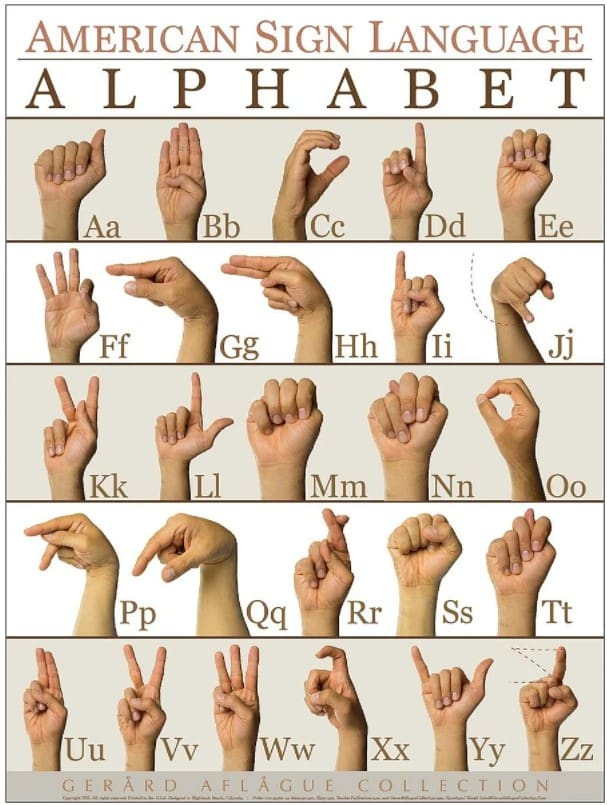

# ASL Sign Language Detection using EfficientNet-DeiT Hybrid Model

This project detects American Sign Language (ASL) alphabets (A-Z) in real-time using a webcam feed. It combines **EfficientNet-B0** and **DeiT-Base** models for robust feature extraction and classification.
<p align="center">
  
</p>


## Requirements

- Python 3.7+
- PyTorch
- OpenCV
- torchvision
- timm
- numpy
- Pillow

Install the dependencies:

```bash
pip install torch torchvision opencv-python timm numpy pillow
```

## How it Works

- Captures live video from your webcam.
- Preprocesses each frame and feeds it into a hybrid CNN-Transformer model.
- Predicts the ASL letter shown with the hand.
- Displays the prediction in real-time on the video feed.

## Files

- `train.py` — Defines the `EfficientNetDeiTHybrid` model.
- `model.pth` — Pretrained model weights file.
- `test.py` — Captures webcam feed and makes real-time predictions.

## How to Run

1. Make sure your webcam is connected and accessible.
2. Place the model checkpoint (`efficientnet_deit_best.pth`) in the correct path (update it in the code if needed).
3. Run the script:

```bash
python main.py
```

4. A window will open showing the webcam feed with real-time ASL predictions.
5. Press `q` to exit the application.

## Notes

- If you are using Docker, run the container with webcam access:

```bash
docker run --device=/dev/video0 your_image_name
```

- Make sure the model path inside the script (`/kaggle/working/efficientnet_deit_best.pth`) is updated if you move the file.

## Results
- Following results are achieved
   <p align="center">
  
</p>

## Troubleshooting

- **Error: Could not open webcam** — Check if your webcam is properly connected and accessible.
- **CUDA not available** — The script automatically switches to CPU if GPU is not available.
- **Model not found** — Ensure the `.pth` file is in the correct location and the path is correctly mentioned in the script.
